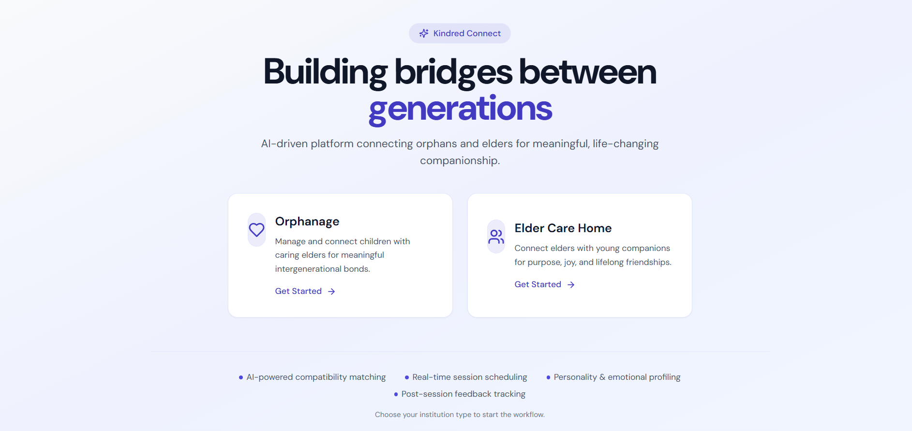
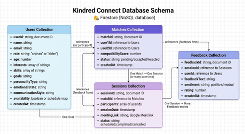
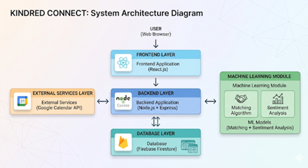
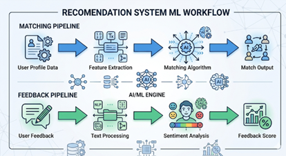
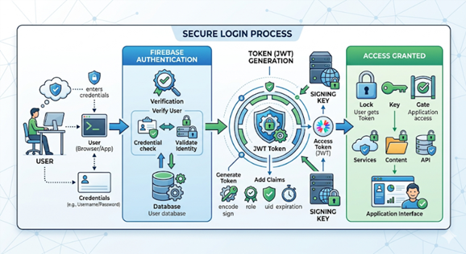

# Kindred Connect

<div align="center">



**Where lost hearts find home-connecting orphan children with elderly individuals through meaningful, AI-powered relationships.**

[](https://react.dev)
[](https://nodejs.org)
[](https://www.python.org)
[](https://firebase.google.com)


</div>

---

## Table of Contents

- [Overview](#overview)
- [Problem & Solution](#problem--solution)
- [Features](#features)
- [Tech Stack](#tech-stack)
- [System Architecture](#system-architecture)
- [AI Models](#ai-models)
- [Project Structure](#project-structure)
- [Installation & Setup](#installation--setup)
- [API Endpoints](#api-endpoints)
- [System Flow](#system-flow)
- [Contributing](#contributing)
- [Team](#team)
- [License](#license)

---

## Overview

Kindred Connect is an innovative AI-powered platform that bridges the emotional gap between isolated orphan children senior citizens in elder-care homes. Through intelligent profile matching, guided sessions, and sentiment analysis, the platform facilitates meaningful relationships that benefit both demographics.

The platform uses a sophisticated matching algorithm combined with post-session sentiment analysis to continuously improve connection quality and relationship outcomes. By leveraging Firebase for real-time data management and custom ML models, Kindred Connect enables sustainable, emotionally supportive connections.

---

## Problem & Solution

### The Problem

- **Orphan children** struggle with emotional isolation, lacking mentors and positive role models
- **Elderly individuals** experience loneliness and reduced social engagement
- Traditional mentorship programs lack personalized matching and outcome tracking and giving a sense of belongingness.

### The Solution

Kindred Connect automates and optimizes the connection process through AI-powered matching and continuous feedback loops.

---

## Features

| Feature | Description |
|---------|-------------|
| **Smart Profile Matching** | AI algorithm scores compatibility between children and elderly based on personality traits, interests, and geographic proximity |
| **Admin Approval System** | Multi-layer verification ensuring child safety and connection appropriateness |
| **Video Session Integration** | Real-time video conferencing with integrated meeting scheduling |
| **Sentiment Analysis** | Post-session transcript analysis to measure emotional engagement and relationship quality |
| **Automated Scheduling** | Google Calendar integration for seamless meeting coordination |
| **Relationship Reports** | Comprehensive reports tracking session frequency, sentiment trends, and relationship progression |
| **Feedback Mechanism** | Structured feedback forms for both participants |
| **Scalable Architecture** | Microservices design supporting horizontal scaling |
| **Real-time Notifications** | Instant updates for scheduled sessions and match confirmations |
| **Session Analytics** | Dashboard showing connection metrics and engagement trends |

---

## Tech Stack

| Layer | Technology | Version |
|-------|-----------|---------|
| **Frontend** | React | 18.3.0 |
| | Vite | Latest |
| | Tailwind CSS | Latest |
| | Radix UI | v1.x |
| **Backend** | Node.js / Express | 18+ / 4.19.0 |
| | Firebase Admin SDK | 12.0.0 |
| **Database** | Firebase Firestore | Real-time |
| **ML Service** | Python | 3.9+ |
| | scikit-learn | Latest |
| **APIs** | Google Calendar API | v3 |
| | Firebase Auth | Latest |
| **Deployment** | Firebase Hosting | Cloud |



---

## System Architecture


```
┌─────────────────────────────────────────────────────────────┐
│                        CLIENT LAYER                         │
│                    React Frontend (Vite)                    │
│  (Dashboard, Profiles, Sessions, Reports, Admin Panel)     │
└────────────────────────┬────────────────────────────────────┘
                         │ HTTPS
                         ▼
┌─────────────────────────────────────────────────────────────┐
│                      API LAYER                              │
│         Express.js Backend (Node.js)                        │
│  ├─ Authentication & Authorization                         │
│  ├─ Profile Management                                     │
│  ├─ Matching Engine Interface                              │
│  ├─ Session Management                                     │
│  └─ Feedback & Reporting                                   │
└────────────────────────┬────────────────────────────────────┘
                         │ Service Communication
                         ▼
┌─────────────────────────────────────────────────────────────┐
│                   DATA & ML LAYER                           │
│                                                              │
│  ┌──────────────────┐         ┌──────────────────┐         │
│  │ Firestore        │         │ ML Service       │         │
│  │ ├─ Profiles      │         │ (Python)         │         │
│  │ ├─ Matches       │         │ ├─ Matching Model│         │
│  │ ├─ Sessions      │         │ ├─ Sentiment     │         │
│  │ └─ Feedback      │         │ └─ Analysis      │         │
│  └──────────────────┘         └──────────────────┘         │
│                                                              │
└─────────────────────────────────────────────────────────────┘
```

### Architecture Layers

**Client Layer**: React-based SPA providing intuitive UI for user interactions  
**API Layer**: Express.js backend handling business logic, authentication, and routing  
**Data Layer**: Firebase Firestore for real-time data persistence  
**ML Layer**: Python microservice for intelligent matching and sentiment analysis  


---

## AI Models

### 1. Profile Matching Engine

**Purpose**: Intelligently match orphan children with elderly individuals based on compatibility

**Features Used**:
- Interest alignment (hobbies, activities)
- Personality trait similarity (Big Five factors)
- Communication style compatibility
- Geographic proximity
- Availability patterns

**Why Rule-Based Instead of Deep Learning**:
- Domain-specific rules ensure safety and appropriateness
- Interpretability required for admin approval workflow
- Smaller dataset unsuitable for deep neural networks
- Real-time scoring without computational overhead

**Scoring Algorithm**:
```
Compatibility Score = 
  (0.3 × Interest Match) + 
  (0.25 × Personality Fit) + 
  (0.2 × Availability Overlap) + 
  (0.15 × Communication Style) + 
  (0.1 × Proximity Factor)
```

**Output**: Ranked matches with confidence scores (0-100)



### 2. Sentiment Analysis Engine

**Purpose**: Measure emotional engagement and relationship quality post-session

**Input**: Session transcript (text)

**Output**: 
- Dominant emotion (joy, sadness, neutral, etc.)
- Engagement score (0-100)
- Sentiment trend (positive, neutral, negative)
- Interaction quality metrics

**Model Components**:
- Sentiment classification (trained on conversational data)
- Emotion detection (7 core emotions)
- Engagement heuristics (response length, question frequency, empathy markers)

**Technology**: scikit-learn with custom feature extraction

---

## Project Structure

```
kindred-connect/
├── frontend/                      # React Vite application
│   ├── src/
│   │   ├── components/           # Reusable UI components
│   │   │   ├── Dashboard.jsx
│   │   │   ├── ProfileForm.jsx
│   │   │   ├── MatchCard.jsx
│   │   │   ├── SessionScheduler.jsx
│   │   │   ├── MeetingRoom.jsx
│   │   │   ├── FeedbackForm.jsx
│   │   │   └── ui/              # Radix UI components
│   │   ├── pages/               # Route pages
│   │   │   ├── Home.jsx
│   │   │   ├── Login.jsx
│   │   │   ├── Signup.jsx
│   │   │   ├── Dashboard.jsx
│   │   │   ├── Profiles.jsx
│   │   │   ├── Matching.jsx
│   │   │   ├── Sessions.jsx
│   │   │   └── Feedback.jsx
│   │   ├── services/            # API services
│   │   │   ├── api.js
│   │   │   └── firestoreService.js
│   │   ├── context/             # React Context (State management)
│   │   ├── hooks/               # Custom React hooks
│   │   └── App.jsx
│   ├── package.json
│   └── vite.config.mts
│
├── backend/                       # Express.js API server
│   ├── controllers/              # Route handlers
│   │   ├── users.js
│   │   ├── matches.js
│   │   ├── sessions.js
│   │   └── feedback.js
│   ├── routes/                   # API route definitions
│   │   ├── auth.js
│   │   ├── users.js
│   │   ├── matches.js
│   │   └── sessions.js
│   ├── middleware/               # Custom middleware
│   │   └── auth.js              # JWT authentication
│   ├── models/                   # Firebase models/schemas
│   └── server.js               # Express app entry point
│
├── ml-service/                    # Python ML service
│   ├── api/
│   │   └── main.py              # FastAPI application
│   ├── ml-models/
│   │   ├── profile_matching.py  # Matching engine
│   │   └── sentiment_analysis.py # Sentiment model
│   ├── scripts/
│   │   └── generate_dataset.py
│   ├── dataset/
│   │   └── dataset.csv
│   └── requirements.txt
│
├── assets/                        # Images and documentation assets
│   ├── home-page.png
│   ├── architecture-diagram.png
│   ├── database-schema.png
│   └── ml-overview.png
│
├── firebase.json                  # Firebase configuration
├── package.json                   # Root dependencies
└── README.md                      # This file
```

---

## Installation & Setup

### Prerequisites

- Node.js 18+ and npm
- Python 3.9+
- Firebase account
- Google Calendar API credentials

### Step 1: Clone Repository

```bash
git clone https://github.com/yourusername/kindred-connect.git
cd kindred-connect
```

### Step 2: Setup Backend

```bash
cd backend

# Install dependencies
npm install

# Create .env file with Firebase credentials
echo "FIREBASE_ADMIN_KEY=your_service_account_key" > .env

# Start development server
npm run dev
```

Backend runs on `http://localhost:3000`

### Step 3: Setup Frontend

```bash
cd ../frontend

# Install dependencies
npm install

# Create .env file
echo "VITE_FIREBASE_CONFIG=your_firebase_config" > .env

# Start development server
npm run dev
```

Frontend runs on `http://localhost:5173`

### Step 4: Setup ML Service

```bash
cd ../ml-service

# Create virtual environment
python -m venv venv
source venv/bin/activate  # On Windows: venv\Scripts\activate

# Install dependencies
pip install -r requirements.txt

# Start ML service
python api/main.py
```

ML Service runs on `http://localhost:8000`

### Step 5: Firebase Configuration

```bash
# Download service account key from Firebase Console
# Place in backend/serviceAccountKey.json

# Configure Firestore rules (see firebase.json)
firebase deploy --only firestore:rules
```

---

## API Endpoints

| Endpoint | Method | Description | Auth |
|----------|--------|-------------|------|
| `/auth/login` | POST | User login | No |
| `/auth/signup` | POST | User registration | No |
| `/auth/verify` | GET | Verify token | Yes |
| `/users/profile` | GET | Get user profile | Yes |
| `/users/profile` | PUT | Update profile | Yes |
| `/matches/find` | GET | Get potential matches | Yes |
| `/matches/confirm` | POST | Confirm a match | Yes |
| `/sessions/schedule` | POST | Schedule session | Yes |
| `/sessions/history` | GET | Get session history | Yes |
| `/sessions/analyze` | POST | Analyze session sentiment | Yes |
| `/feedback/submit` | POST | Submit feedback | Yes |
| `/feedback/report` | GET | Get relationship report | Yes |
| `/admin/users` | GET | List all users (Admin) | Admin |
| `/admin/matches/approve` | POST | Approve match (Admin) | Admin |

---

## System Flow

```
1. USER REGISTRATION & PROFILE CREATION
   └─> Register (email/password) → Complete profile → Firebase stores data

2. MATCHING PHASE
   ├─> User requests matches
   ├─> ML Engine scores compatibility
   ├─> Top matches displayed to user
   └─> User selects preferred match

3. ADMIN APPROVAL
   ├─> Admin reviews match request
   ├─> Verifies appropriateness & safety
   └─> Approves/Rejects match

4. CONNECTION ESTABLISHED
   ├─> Both users notified
   ├─> Calendar invited for initial meeting
   └─> Meeting room link generated

5. SESSION MANAGEMENT
   ├─> Video conference initiated
   ├─> Session recorded (transcript)
   └─> Post-session survey form

6. SENTIMENT ANALYSIS
   ├─> ML Service processes transcript
   ├─> Extracts sentiment & engagement scores
   └─> Updates relationship dashboard

7. CONTINUOUS IMPROVEMENT
   ├─> Feedback collected from both parties
   ├─> Relationship metrics tracked
   ├─> Future matches refined based on data
   └─> Cycle repeats
```

---

## UI Preview

### Home Page


Landing page showcasing the platform's mission and core features.

### Login & Onboarding



Secure authentication and profile setup flow.

---

## Future Improvements

- [ ] Real-time sentiment analysis during sessions using speech processing
- [ ] Voice-based emotion detection for deeper engagement measurement
- [ ] Reinforcement learning to optimize matching algorithm
- [ ] Mobile native application (React Native)
- [ ] Demographic-based insights and impact reporting
- [ ] Integration with social media for profile enrichment
- [ ] Peer mentoring groups in addition to 1-on-1 connections
- [ ] AI-powered conversation guidance during sessions
- [ ] Integration with government welfare programs
- [ ] Multi-language support

---

## Contributing

Contributions are welcome! Follow these guidelines:

1. **Fork** the repository
2. **Create** a feature branch (`git checkout -b feature/amazing-feature`)
3. **Commit** changes (`git commit -m 'Add amazing feature'`)
4. **Push** to branch (`git push origin feature/amazing-feature`)
5. **Open** a Pull Request with detailed description

### Code Standards

- Use meaningful variable names
- Add comments for complex logic
- Follow existing code style
- Write unit tests for new features
- Update README if adding new sections

---

## Team

| Name | Role | GitHub ID |
|------|------|-----------|
| Project Architect | System Design & ML Models | [@purvii12](https://github.com/purvii12) |
| Backend Developer | API & Infrastructure | [@vaibhhaav](https://github.com/vaibhhaav) |
| Database Engineer | Schema & Data Management | [@Palak-Khurana](https://github.com/Palak-Khurana), [@vaibhhaav](https://github.com/vaibhhaav) |
| Frontend Developer | UI/UX Implementation | [@aastha-git32](https://github.com/aastha-git32), [@Palak-Khurana](https://github.com/Palak-Khurana), [@satkiran11](https://github.com/satkiran11) |
| ML Engineer | Models & Analysis | [@purvii12](https://github.com/purvii12) |

---

## License

This project is licensed under the MIT License - see the [LICENSE](LICENSE) file for details.

---

<div align="center">

**Kindred Connect** believes that meaningful connections can transform lives. Every match made is a step toward reducing loneliness and building more compassionate communities.

Made with care for those who seek connection. ❤️

</div>
